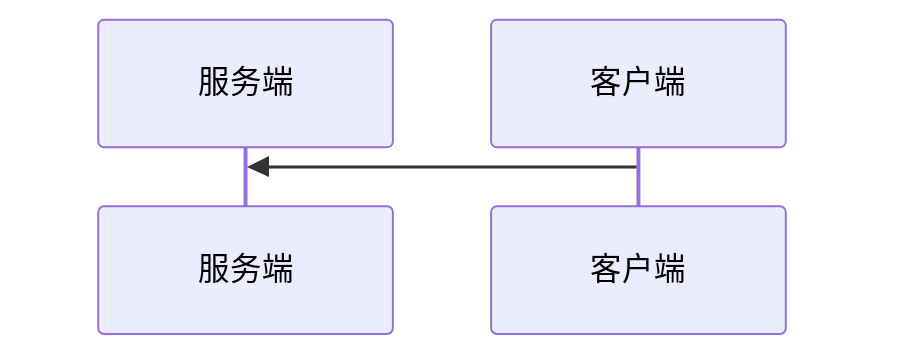

# README

## 运行环境

以下为编译本项目的一些说明:

1. 本项目引用了 `jsoncpp` 这个项目，在 `Linux` 环境下，安装 `jsoncpp`，编译时使用命令行参数 `-ljsoncpp`. 参考：<https://www.codeproject.com/Articles/1102603/Accessing-JSON-Data-with-Cplusplus>

## 协议简述

### `ReliableSocket`

这个简单的 `TlsUdpProtocol` 项目在实现可靠的传输层协议 `ReliableSocket` 时忽略了以下这些问题：

1. **不考虑**服务器同时为**多个客户端**提供服务的情况，客户端连接之后不会进行线程新增、分配资源等工作；
2. 因为不分配资源，在实现可靠的 `UDP` 传输时，双方**不进行三次握手**交换初始序列号，默认初始序列号为 0，只进行一次客户端告知长度的握手过程；
3. 协议会对信息进行分包，**包的默认大小为 `1K`** (1024 bytes)；
4. 协议**不实现窗口机制**，将按序号简单传输所有块，并且等待每个块的 `ACK`；
5. 协议不实现快速重传，**只实现超时重传**，默认的 `timoutInterval` 为 `1s`；
6. 本层认为在传输过程中，没有比特位的偏差，**不计算 `hash checksum`**；

`fomatSocket` 继续封装了 6 个字节于头部：

| bytes 1-2 | bytes 3-4  |  bits 33   |  bits 34   |   bits 35    |   bits 36    | bits 37-48 |
| :-------: | :--------: | :--------: | :--------: | :----------: | :----------: | :--------: |
| 包的长度  | 包的序列号 | 握手标志位 | 结束标志位 | `ACK` 标志位 | `MSG` 标志位 |  尚未使用  |

`ReliableSocket` 建立大致的连接过程（有过调整）：

- 程序内部逻辑：

  

- 调用的 `API` 函数尽量的模拟 TCP 的 API 函数：

  

### `SecureSocket`

安全层建立连接:



## 项目结构 可执行文件

### `TestClass/UdpTelnet.cpp`

一个包含 `main` 函数的可执行文件，其使用方式为：

```bash
$ ./udptelnet <Server IP> <Server Port>
```

之后在标准输入中对程序进行输入，程序会将字符串发送给目标主机。

## 项目结构 类

### `UdpSocket`

一个包含实现 UDP 套接字的类。参考：http://cs.ecs.baylor.edu/~donahoo/practical/CSockets/practical/