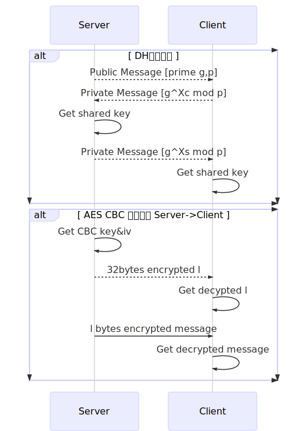

# README

## 运行环境

以下为编译本项目的一些说明:

1. 本项目引用了 `jsoncpp` 这个项目，在 `Linux` 环境下，安装 `jsoncpp`，编译时使用命令行参数 `-ljsoncpp`. 参考：<https://www.codeproject.com/Articles/1102603/Accessing-JSON-Data-with-Cplusplus>
2. 本项目的大整数计算使用了 `GNU` 的 `gmp` 项目，在 `Linux` 环境下，编译时使用命令行参数 `-lgmp`. 参考：
   1. 手册：<https://gmplib.org/manual/>
   2. 接口：<https://gmplib.org/manual/C_002b_002b-Class-Interface.html#C_002b_002b-Class-Interface>
   3. 数论接口：<https://gmplib.org/manual/Number-Theoretic-Functions.html>
3. 本项目引用了 `openssl` 这个开源加密项目进行加密，编译时使用命令行参数 `-lcrypto`。

## `UdpSocket`

一个通过面向对象编程的方式，将底层提供的 `UDP` 封装成一个对象。参考：http://cs.ecs.baylor.edu/~donahoo/practical/CSockets/practical/

以下是可执行文件 `TestClass/UdpServer.cpp` 与 `TestClass/UdpTelnet.cpp` 的演示视频：

## `ReliableSocket`

这个简单的 `TlsUdpProtocol` 项目在实现可靠的传输层协议 `ReliableSocket` 时忽略了以下这些问题：

1. **不考虑**服务器同时为**多个客户端**提供服务的情况，客户端连接之后不会进行线程新增、分配资源等工作；
2. 因为不分配资源，在实现可靠的 `UDP` 传输时，双方**不进行三次握手**交换初始序列号，默认初始序列号为 0，只进行一次客户端告知长度的握手过程；
3. 协议会对信息进行分包，**包的默认大小为 `1K`** (1024 bytes)；
4. 协议**不实现窗口机制**，将按序号简单传输所有块，并且等待每个块的 `ACK`；
5. 协议不实现快速重传，**只实现超时重传**，默认的 `timoutInterval` 为 `1s`；
6. 本层认为在传输过程中，没有比特位的偏差，**不计算 `hash checksum`**；

`fomatSocket` 继续封装了 6 个字节于头部：

| bytes 1-2 | bytes 3-4  |  bits 33   |  bits 34   |   bits 35    |   bits 36    | bits 37-48 |
| :-------: | :--------: | :--------: | :--------: | :----------: | :----------: | :--------: |
| 包的长度  | 包的序列号 | 握手标志位 | 结束标志位 | `ACK` 标志位 | `MSG` 标志位 |  尚未使用  |

`ReliableSocket` 建立大致的连接过程（有过调整）与外界调用的 `API`：

以下是可执行文件 `TestClass/ReliableServer.cpp` 与 `TestClass/ReliableTelnet.cpp` 的演示视频：

## `SecureSocket`

实现在传输层与应用层中，实现加密传输（类比 `TLS` 协议），该套接字继承于 `ReliableSocket`，重写了 `connectForeignAddressPort()` 与 `startListen()` 这两个握手函数，`sendMessage()` 与 `receiveMessage()` 这两个传输信息的函数。

这个简单的安全套接层未考虑以下的安全问题：

1. **客户端过载**的拒绝服务攻击（实际上这个安全问题在 `ReliableSocket` 中就已经避免），因为经常在运行时调用 `mpz` 的大整数运算库，会占用大量的服务器资源；
2. 使用原生指针而非智能指针，许多**内存泄漏**问题未考虑，可能存在安全隐患；
3. 传输的比特最大大小为 `unsigned int` 型变量的最大值，即 $$2^{32} bits = 2^{29} bytes = 2^{9} MB = 512 MB$$，如果传输的内容大小大于这个大小，则会导致**整数溢出**，从而导致内存泄漏等安全因素。
4. 在 `AES` 加密传输中，首先会对信息长度加密进行传输，为了保证信息的最大长度为 `32` 比特，默认使用两个 `AES_BLOCK` 进行传输，但是这个长度可以通过正文长度推测出来。比如我们传输的信息长度明显小于 `256B`，那么第二个 `AES_BLOCK` 一定是全零，这会导致**已知明文攻击**。

`Public` 信息（如果密钥长度设置为 1024 位的话）交换格式如下：

|     1-2 bytes     |  3-4 bytes  | 4-132 bytes (1024 bits) | 132-260 bytes (1024 bits) |
| :---------------: | :---------: | :---------------------: | :-----------------------: |
| 请求体大小 (2048) | 16 个标志位 |       公共素数 G        |        公共素数 P         |

`Private` 信息（如果密钥长度设置为 1024 位）交换格式如下：

|     1-2 bytes     |  3-4 bytes  |          4-132 bytes           |
| :---------------: | :---------: | :----------------------------: |
| 请求体大小 (1024) | 16 个标志位 | 生成共享信息：$$g^X \pmod{p}$$ |

从 `1024 bits` 的共享信息，得到 `AES CBC` 的密钥 `key` 和向量 `iv` 的策略如下（假设为默认使用 `256 bits`）：

| 0-255 bits | 256-383 bits | 384-1024 bits |
| :--------: | :----------: | :-----------: |
|  密钥 key  | 初始向量 iv  |   暂未使用    |

传输示例图如下：

以下是可执行文件 `TestClass/SecureServer.cpp` 与 `TestClass/SecureTelnet.cpp` 的演示视频：

## `AppSocket`

`AppSocket` 按照实验要求，在 client 与 server 建立连接之后传递指定信息，

信息的格式为：

| 2 bytes  |     4 bytes     | 2 bytes (optional) | <1000 bytes (optional) |
| :------: | :-------------: | :----------------: | :--------------------: |
| `Header` | `PayloadLength` |     `PacketID`     |       `Content`        |

`content` 中可以存储 `password`，`digest` 或者 `data`

通过函数进行整合与拆解，方便获得各部分信息。

最后根据实验要求的流程，使两端收发信息，并在密码错误，`sha1` 检测失败等情况下报错。

为了使得 server 端得知 digest 码比对是否成功，client 会在比对 digest 码之后发送一个包确认是否成功收到（准确）信息，这样最终可以两端同时输出 OK/ABORT。

传输的实例图如下：

以下是可执行文件 `Server/AppServer.cpp` 与 `Client/AppClient.cpp` 的演示视频：

